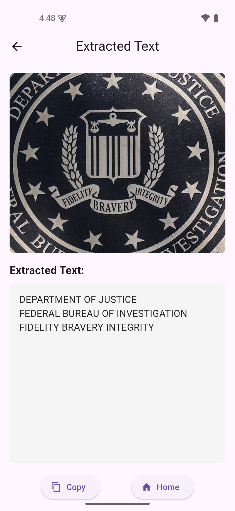

# Image2Text App

Image2Text is a Flutter-based mobile application that allows users to extract text from images. Users can either select an image from their gallery or take a photo using their device's camera. The app processes the image and displays the extracted text, with options to copy the text to the clipboard or return to the home screen.

## Features

- **Image Selection**: Choose an image from the gallery or capture a photo using the camera.
- **Text Extraction**: Converts the selected image into text using the Gemini API.
- **Copy to Clipboard**: Easily copy the extracted text for use in other applications.
- **Clean UI**: Modern and intuitive design for a seamless user experience.

## Screenshots




## Technologies Used

- **Flutter**: Cross-platform framework for the frontend.
- **Gemini API**: For image-to-text conversion.


## Installation

1. **Clone the Repository**:
   ```bash
   git clone https://github.com/santoshvandari/Image2Text.git
   cd Image2Text
   ```

2. **Install Dependencies**:
   ```bash
   flutter pub get
   ```

3. **Run the Application**:
   ```bash
   flutter run
   ```

## Usage

1. Launch the application.
2. Tap the "Select Image" button.
3. Choose an image from the gallery or capture a photo.
4. View the extracted text on the Result Screen.
5. Copy the text to the clipboard or return to the home screen.

## API Integration

The app uses the Gemini API for text extraction. Replace the placeholder API key in `/lib/api_key.dart` with your actual API key:

```dart
final String apikey = '<API_KEY>';
```

## Acknowledgments

- [Flutter](https://flutter.dev)
- [Gemini API](https://ai.google.dev/gemini-api/docs/api-key)

## Permissions

The app requires Camera and Storage Access permissions to capture and read the local photos. If the permission is not granted, the app will prompt the user to allow permission.

**Required Permissions**:

- **Camera Permission**: To Capture the Image.
- **Storage Permission**: To Read the Image from Gallery.
- **Internet Permission**: To Fetch the Data from the API.

For Android, ensure that the following permissions are added in the `AndroidManifest.xml`:

```xml
<uses-permission android:name="android.permission.CAMERA"/>
<uses-permission android:name="android.permission.READ_EXTERNAL_STORAGE"/>
<uses-permission android:name="android.permission.WRITE_EXTERNAL_STORAGE"/>
<uses-permission android:name="android.permission.INTERNET"/>
```

## Packages Used

- `flutter`: The Flutter framework for building the app.
- `image_picker`: For selecting images from the gallery or capturing photos.
- `http`: For making HTTP requests to the Gemini API.


## Installation
To install the app on your Android device:
1. Download the latest APK from the [Releases](https://github.com/santoshvandari/Image2Text/releases) section.
2. Transfer the APK to your phone and install it.

## Contributing
We welcome contributions! Feel free to submit a pull request or open an issue if you find bugs or want to add new features. Check out the [Contributing Guidelines](CONTRIBUTING.md) for more information.

## License
This project is licensed under the MIT License. See the [LICENSE](LICENSE) file for details.

## Contact
For any inquiries or support, please reach out at:
- **GitHub**: [@santoshvandari](https://github.com/santoshvandari)

---

### If you like this project, don't forget to give it a ⭐ and share it with others!

### Made By Santosh Bhandar❤️ 

### Keep Coding Keep Smiling